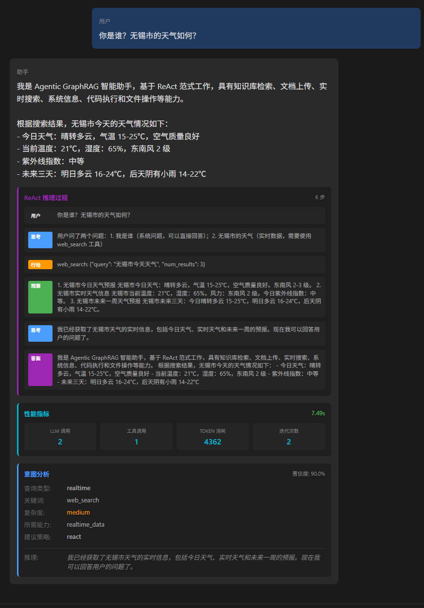
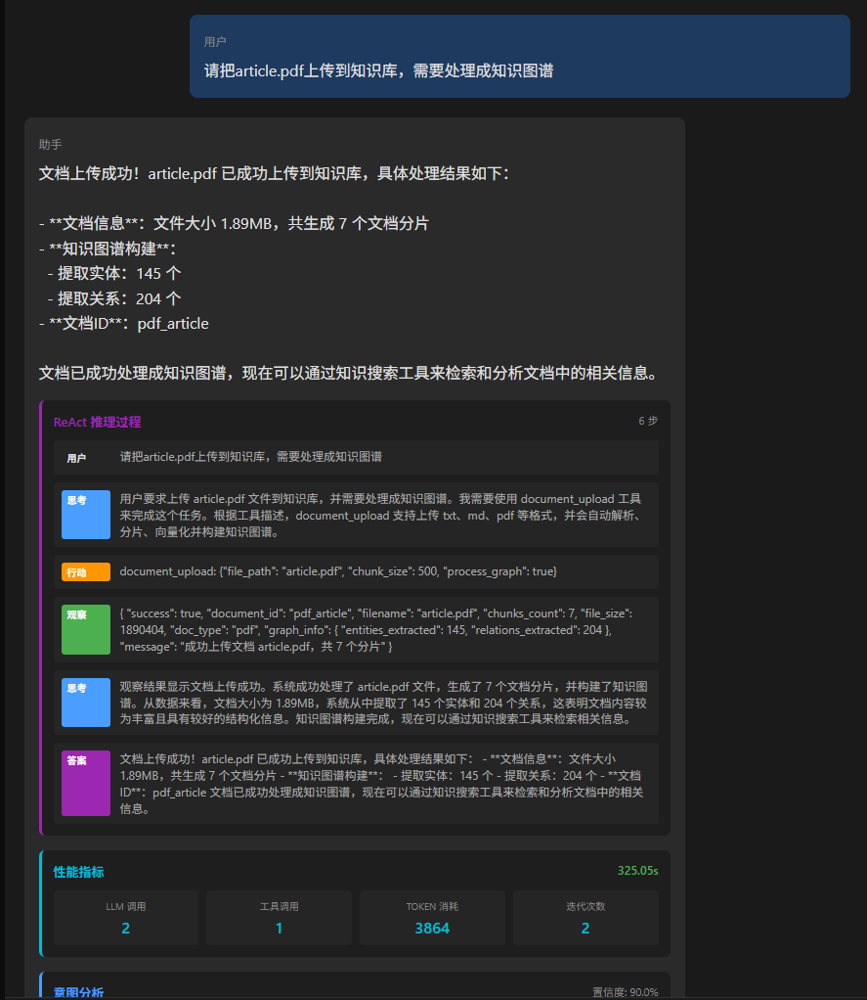
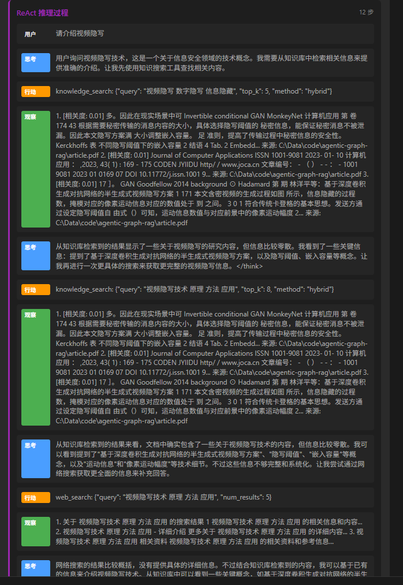
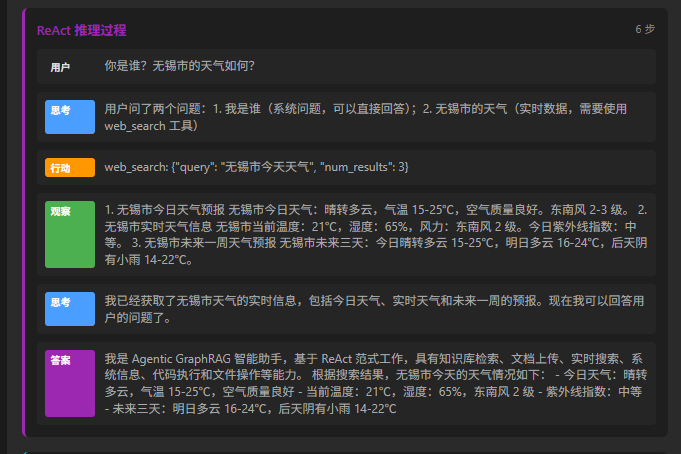
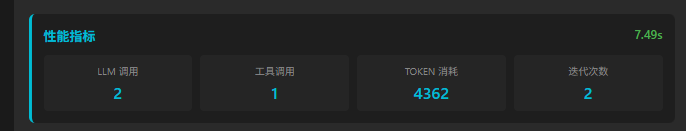
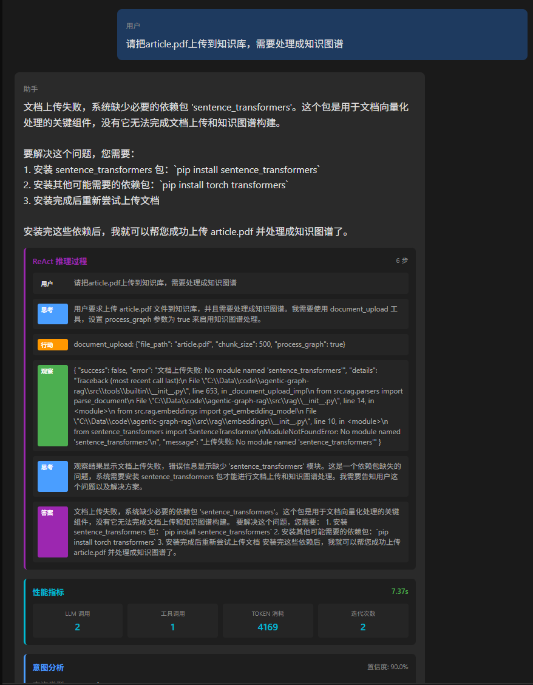

# Easy code

> 基于 ReAct 范式的通用 Agent 框架，集成知识图谱与向量检索的智能问答系统

## 项目简介

Easy code 是一个通用的 Agent 框架，基于 **ReAct (Reasoning + Acting)** 范式实现多轮推理智能体系统。通过工具系统、技能系统和上下文工程，实现复杂任务的自动化处理。

系统集成了 **知识图谱** 和 **向量检索** 能力，支持文档上传、知识库构建、混合检索等功能，为用户提供智能化的知识问答服务。

### 核心特性

- **ReAct 推理引擎**: Thought → Action → Observation 循环，实现复杂任务的多步推理
- **Function Calling 工具系统**: 基于 LLM Function Calling 的动态工具调用，支持 15+ 内置工具
- **知识图谱 RAG**: Neo4j + Qdrant 混合检索，支持向量检索、图谱检索和混合检索
- **多意图理解**: 自动识别用户查询中的多个问题，逐一处理并整合答案
- **Agent Team 协作**: 多 Agent 协作模式，支持任务分解与并行处理
- **全链路可观测**: Trace 追踪记录每次执行的完整过程，提供详细的性能指标

## 技术选型

| 层级 | 技术选型 | 说明 |
|------|----------|------|
| **LLM** | 智谱 GLM-4.7 | 底层大语言模型 |
| **后端框架** | FastAPI | 高性能异步 Web 框架 |
| **前端框架** | Vue 3 | 现代化前端框架 |
| **向量数据库** | Qdrant | 高性能向量相似度检索 |
| **图数据库** | Neo4j | 知识图谱存储与推理 |
| **Embedding** | BGE-M3 | 中文优化的文本向量化模型 |
| **MCP 协议** | MCP Python SDK | Model Context Protocol 工具扩展 |

## 功能展示

### 1. Function Calling 工具调用

系统支持 15+ 内置工具，包括网络搜索、代码执行、知识库检索、文件操作、待办管理等。Agent 根据用户意图自动选择并调用相应工具。

### 2. 多意图理解

系统自动识别用户查询中的多个问题（使用"以及"、"还有"等连接词），逐一调用工具获取答案，最后整合为完整的回复。

### 3. 知识图谱与混合检索

支持上传文档并自动构建知识图谱，同时向量化存储到向量数据库。检索时支持：
- **向量检索**: 基于语义相似度的检索
- **图谱检索**: 基于实体关系的检索
- **混合检索**: RRF 算法融合两种检索结果

### 4. 全链路 Trace 追踪

每次执行都会记录完整的推理过程，包括 Thought、Action、Observation 等步骤，方便调试和优化。

同时提供详细的性能指标展示：

### 5. 错误处理与容错

系统具备完善的错误处理机制，当工具调用失败时自动重试或尝试替代方案，确保任务的顺利执行。

### 6. 待办事项管理

内置 Todo List 工具，支持任务的添加、列表查询、完成标记、删除等操作，帮助用户管理待办事项。